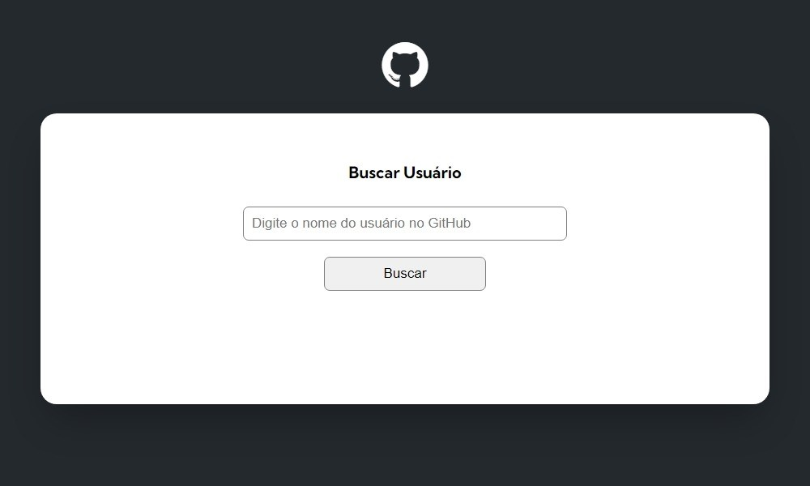

# Projeto de fetch usando api do GitHub

- Projeto que consome a API do GitHub usando o fetch para buscar informações dos usuários e mostrar em tela.

## ScreenShots

- Screnshot do site

    

## Tecnologias utilizadas

  

## Link

- Live Site: <a 
                href="https://teoniuvilarinho.github.io/projeto-fetch-api-github" target="_blank">www.fetch-api-github.com
            </a>